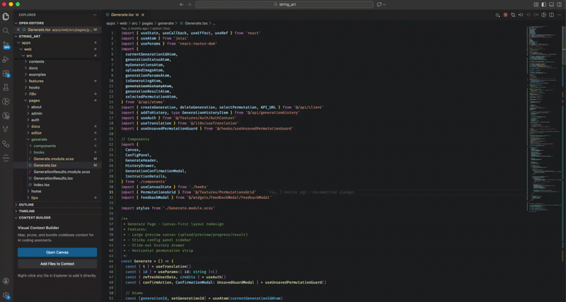

# Visual Context Node Builder for AI

**Stop blindly pasting files into ChatGPT.** Take control of exactly what your AI sees.

An infinite-canvas node graph inside VS Code where you visually map your codebase, prune what's irrelevant, and export a perfectly structured context bundle — ready for any AI coding assistant.



## Why This Exists

Every AI coding tool has the same problem: **context**. You either dump entire files and burn tokens, or you manually copy-paste snippets and lose the big picture. Neither works well.

This extension gives you a visual workspace to **see** your code relationships, **choose** exactly what goes in, and **export** a clean, structured prompt — with full control over every line.

## Key Features

### Node Graph Canvas
Drop files from the Explorer onto an infinite canvas. Each node shows the file's exports — functions, classes, types — and lets you toggle individual symbols on/off. Only include what matters.

### One-Click Dependency Expansion
Hit **Expand Deps** on any file node and watch its import tree unfold across the canvas. Filter by category (source, styles, data) so you don't drown in noise.

### Package Type Resolution
Need the AI to understand your dependencies? Add packages directly — the extension resolves `.d.ts` type definitions from `node_modules` and displays them inline.

### Privacy Redaction
Mark any node as redacted. Its content becomes `[REDACTED FOR PRIVACY]` in the export — the file stays in the graph for structural context, but sensitive code never leaves your machine.

### System Templates
Pre-built instruction sets for common tasks: **Code Review**, **Refactor**, **Bug Fix**, **Explain Code**, and **New Feature**. One click to set the AI's role and constraints.

### Recipes
Save your canvas layouts as reusable recipes. Next time you need the same context setup, load it in one click instead of rebuilding from scratch.

### Live Token Estimation
A running token count updates as you add, remove, or modify nodes. Know exactly how much context you're sending before you send it.

### Structured Export
Generate your context as **Markdown** or **XML** — optimized for how LLMs parse structured input. Copy to clipboard or save to file.

## Getting Started

1. Install the extension
2. Open the Command Palette (`Ctrl+Shift+P` / `Cmd+Shift+P`)
3. Run **"Open Visual Context Builder"**
4. Right-click any file in the Explorer and select **"Add to Visual Context"**
5. Expand dependencies, prune nodes, write your prompt
6. Click **Generate Context** and paste into your AI assistant of choice

## AI-Powered Recipe Generation

**Let your AI coding assistant build recipes for you.** Instead of manually dragging files onto the canvas, ask your AI tool to analyze the codebase and generate a ready-to-use recipe. It searches your code, identifies relevant files and dependencies, and creates a `.vcnb/recipes/<name>.json` file you can open, edit, and export — all in one command.

The generated recipe includes:
- **File nodes** pointing to every relevant source file
- **Sticky notes** explaining key patterns and gotchas
- **System instructions** tailored to the task (review, debug, refactor, etc.)
- **Dependency edges** showing how files relate to each other

This works with any AI coding tool. Pick your setup below.

---

### Claude Code

Claude Code gets a native `/vcnb` slash command for the smoothest experience.

**Setup:**

```bash
# From the extension repo
mkdir -p .claude/commands
cp skills/vcnb.md .claude/commands/

# Or download directly into any project
mkdir -p .claude/commands
curl -o .claude/commands/vcnb.md \
  https://raw.githubusercontent.com/pizan/visual-context-node-builder/main/skills/vcnb.md
```

**Usage:**

```
/vcnb the authentication flow
/vcnb all API route handlers and their middleware
/vcnb update auth-flow to include the middleware tests
/vcnb list
```

---

### Cursor

Cursor loads instructions from `.cursorrules` at your project root.

**Setup:**

Append the contents of [`skills/vcnb-rules.md`](skills/vcnb-rules.md) to your `.cursorrules` file:

```bash
# Download and append to your existing .cursorrules
curl -s https://raw.githubusercontent.com/pizan/visual-context-node-builder/main/skills/vcnb-rules.md >> .cursorrules
```

**Usage:**

```
Create a VCNB recipe for the authentication flow
Build a visual context map of the payment module
Update the auth-flow recipe to include tests
```

---

### GitHub Copilot

Copilot reads project instructions from `.github/copilot-instructions.md`.

**Setup:**

```bash
mkdir -p .github
curl -s https://raw.githubusercontent.com/pizan/visual-context-node-builder/main/skills/vcnb-rules.md >> .github/copilot-instructions.md
```

**Usage:**

```
Create a VCNB recipe for the authentication flow
Map out the API routes and middleware as a visual context
```

---

### Windsurf

Windsurf loads instructions from `.windsurfrules`.

**Setup:**

```bash
curl -s https://raw.githubusercontent.com/pizan/visual-context-node-builder/main/skills/vcnb-rules.md >> .windsurfrules
```

**Usage:**

```
Create a VCNB recipe for the authentication flow
Build a visual context for the data pipeline
```

---

### Other AI Tools

For any AI tool that supports system-level instructions or custom prompts, use the universal rules file:

1. Download [`skills/vcnb-rules.md`](skills/vcnb-rules.md)
2. Paste its contents into your tool's instructions/rules configuration
3. Ask the AI to "create a VCNB recipe for [your topic]"

The rules file contains the complete recipe JSON schema, layout guidelines, and quality checklist — everything the AI needs to generate valid recipes.

---

### What happens after generation

1. Open the **Visual Context Builder** panel in VS Code
2. Go to the **Recipe Library**
3. Load your generated recipe
4. The canvas populates with all the files, notes, and connections
5. Edit, prune, or expand as needed
6. Export your context as Markdown or XML

## Requirements

- VS Code 1.85+

## Build from Source

```bash
npm install
npm run build
```

```bash
npm test        # run tests
npm run package # create .vsix
```

## License

MIT
